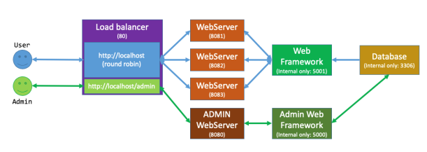

# Distributed Computing

## Requirements 

### Load balancer: 
The load balancer should be a HAProxy based image that performs round robin load 
balancing between 3 running instances of the customer front facing web server. This is to 
avoid overloading any single instance of the web-server. Load balancer would serve any 
requests made to http://localhost address and load balance (using round robin method) 
between the 3-front facing web-servers. Any requests made to http://localhost/admin 
should take people to the admin web-server instead. 

### Web servers: 
There should be 3 instances of the customer facing web server that run identical code but 
on different ports. Their purpose is to present items for sale in an easy to read and 
professional manner (Item name, item quantity and item price). The servers should be 
based on the php:apache image. The web-servers should also display their unique 
hostname at the top left corner. 

### Admin web server: 
The admin web server is based on the same container as the normal web servers but in 
addition to displacing current items being sold it should also have an ability to insert new 
items into the database. It should present a form that allows users to enter all the details 
required to add the new items. If the items is new it should insert it for sale and if it is not a 
new item it should update its quantity on the system. 

### Web-framework: 
The web-framework is based on a python 3 image running the Flask web-framework. This 
framework is meant to query the database (read only) and provide the data as a JSON to the 
web- servers. Data received from the database should be validated. The web-framework 
should not be able to be accessed externally and should only be accessed by containers in 
the system. 

### Admin web-framework: 
The admin web-framework is based on normal web-framework with the additional 
functionality of being able to write into the database to allow for insertion of new items to 
be sold on the store front and allow to update quantity of the currently sold items. Data 
received from the user should be correctly validated before written into the database. 

### Database: 
The database should be based on the mysql image and store the following data: 
• Item name 
• Items quantity 
• Item price 

The database should not be able to be accessed externally and should only be accessed by 
containers in the system.

### Database caching:
You will also need to implement a database caching service. Any requests that have been 
already made to the database should be cached and presented for any new access. 
Database should only be accessed directly if the query made is not in the database cache.